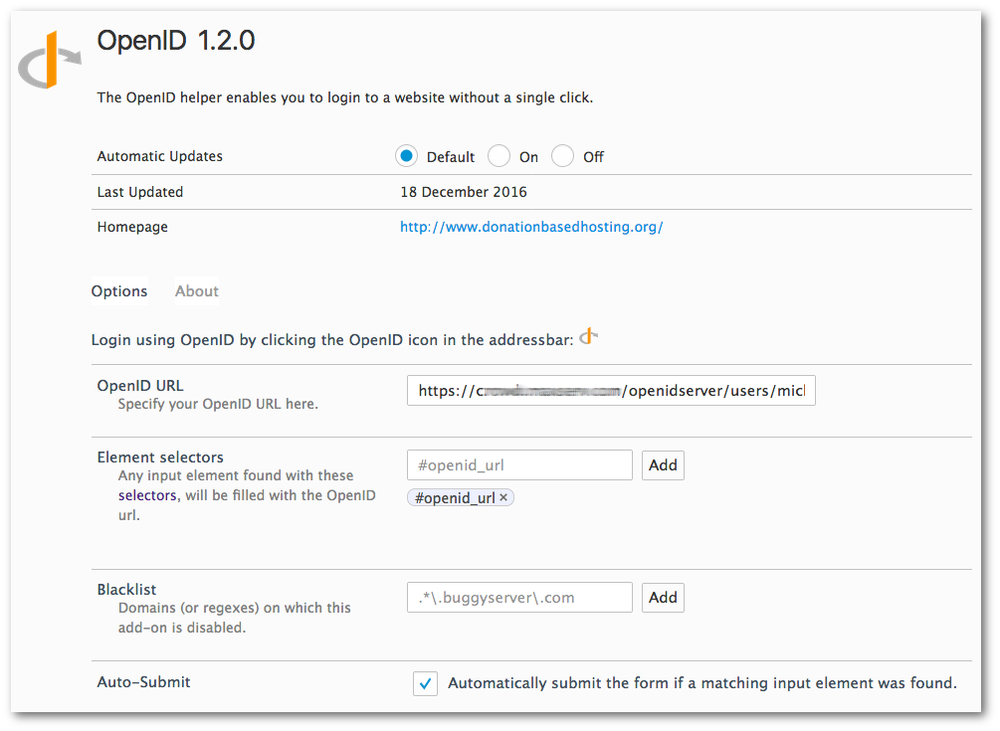
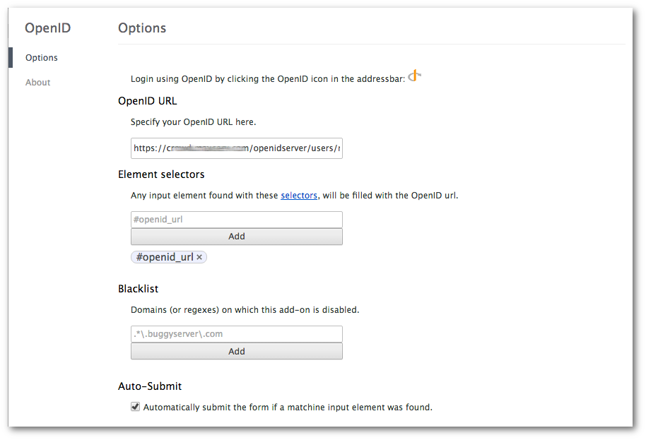

OpenID Helper for Chrome and Firefox
====================================

The OpenID helper enables you to login to a website without a single click.

## Firefox
### Installation
Go to [the Firefox addons site](https://addons.mozilla.org/en-US/firefox/addon/openid-helper/) and click "Add to Firefox".

### Options

## Chrome
### Installation
Go to the [Google Chrome Web Store](https://chrome.google.com/webstore/detail/klfijofcldioojikabdjillmmpnfljbk) and click "Add to Chrome".

### Options

## How do I contribute?
A: [Submit issues and ideas](https://github.com/Tuurlijk/OpenID-helper-for-browser/issues)

B: [Submit a pull request](https://help.github.com/articles/using-pull-requests)

1. Fork this repo and create a branch
2. Commit and push your changes to your branch
3. When you're happy send us a pull request!

_**Pro-tip:** Make sure to build upon the latest version of the code and keep pull request as small as possible. This makes your pull request easy to merge._

## License
This script is distributed in the hope that it will be useful, but
WITHOUT ANY WARRANTY; without even the implied warranty of MERCHANTABILITY
or FITNESS FOR A PARTICULAR PURPOSE. See the GNU General Public License for
more details.
